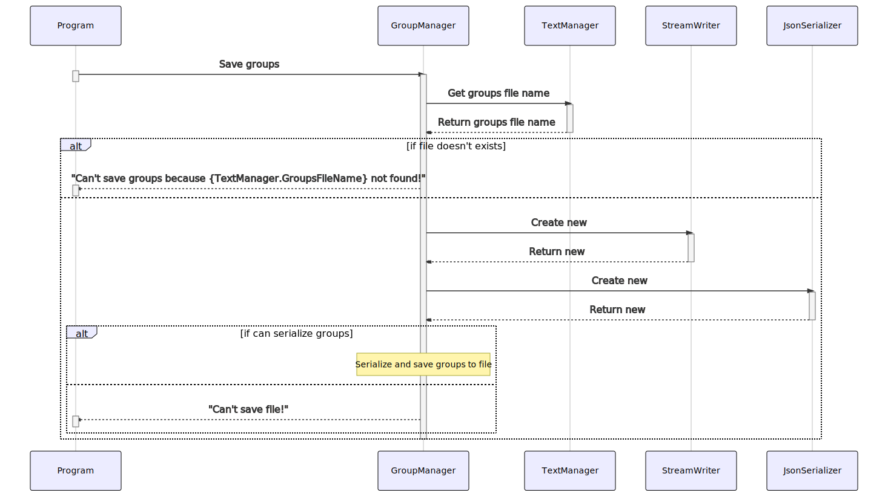

# 1. UML diagrams

- [1. UML diagrams](#1-uml-diagrams)
  - [1.1. Class diagram for driverless section](#11-class-diagram-for-driverless-section)
  - [1.2. Sequence diagram for driverless section](#12-sequence-diagram-for-driverless-section)
    - [1.2.1. Start program](#121-start-program)
    - [1.2.2. Read file](#122-read-file)
    - [1.2.3. Load tracks](#123-load-tracks)
    - [1.2.4. Create group settings](#124-create-group-settings)
    - [1.2.5. Create settings menu](#125-create-settings-menu)
    - [1.2.6. Add attribute to group](#126-add-attribute-to-group)
    - [1.2.7. Add attribute to group from channel](#127-add-attribute-to-group-from-channel)
    - [1.2.8. Create attribute](#128-create-attribute)
    - [1.2.9. Create group](#129-create-group)
    - [1.2.10. Load groups](#1210-load-groups)
    - [1.2.11. Save groups](#1211-save-groups)

## 1.1. Class diagram for driverless section

## 1.2. Sequence diagram for driverless section

### 1.2.1. Start program

### 1.2.2. Read file

### 1.2.3. Load tracks

### 1.2.4. Create group settings

### 1.2.5. Create settings menu

### 1.2.6. Add attribute to group

### 1.2.7. Add attribute to group from channel

### 1.2.8. Create attribute

### 1.2.9. Create group

### 1.2.10. Load groups

### 1.2.11. Save groups

